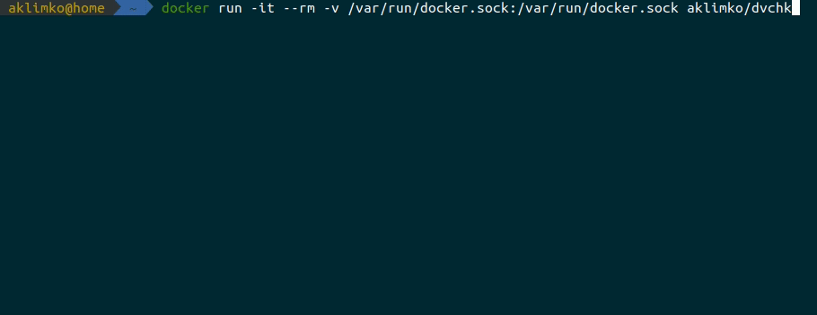

# DVCHK
[](https://travis-ci.com/aklimko/dvchk)
[](https://hub.docker.com/r/aklimko/dvchk)

DVCHK is a tool that checks if there are newer versions of images for your running Docker containers based on SemVer.



## Usage
```shell
docker run -it --rm -v /var/run/docker.sock:/var/run/docker.sock aklimko/dvchk:0.1.0
```

## Configuration
Command line options take precedence over environment variables.

| Option                        | Environment variable | Description                              |
| ----------------------------- | -------------------- | ---------------------------------------- |
| -a, --all                     | DVCHK_ALL            | Print all newer versions                 |
| -k, --insecure                | DVCHK_INSECURE       | Disable TLS certificates validation      |
| -t, --timeout &lt;seconds&gt; | DVCHK_TIMEOUT        | Set timeout for HTTP requests in seconds |
| -v, --verbose                 | DVCHK_VERBOSE        | Include additional logs                  |
